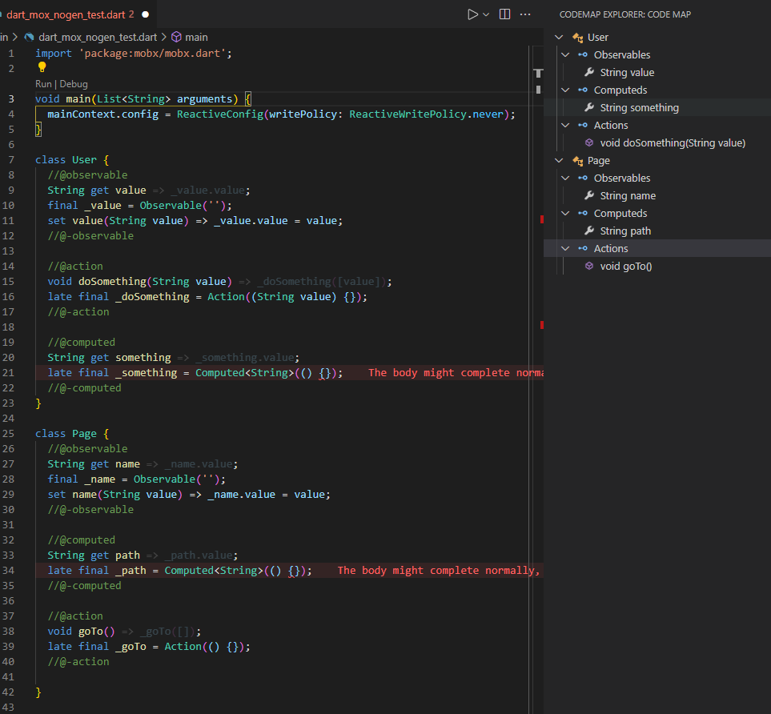

# Dart MobX

## Features

* Foldable regions. Wrap a section of code between region tags to create foldable regions. These are folded by default when opening a file.
    - `//@observable` ... `//@-observable`
    - `//@computed` ... `//@-computed`
    - `//@action` ... `//@-action`

    - Unfolded 
    - Folded 

* Snippets to quickly create the boilerplate for observables, computed fields and actions
    

* Custom mapper for the [CodeMap](https://marketplace.visualstudio.com/items?itemName=oleg-shilo.codemap) extension for observables, computeds and actions. The extension must be installed and configured separately. You can find the mapper [here](src/codemap.mapper.js)  
    

## ROADMAP
* Improve toggle feature
* Option to exclude computed fields and actions when folding all regions